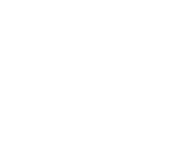

# Pioneer-32 Payload Delivery Robot
An ESP32 powered robot especially designed for transporting payloads over rough terrain.
Using VEX metal chassis framework, claw, and omniwheels, the Pioneer-32 will deliver the tennis ball with elegance and precision, ensuring a flawless performance in the field.

  

